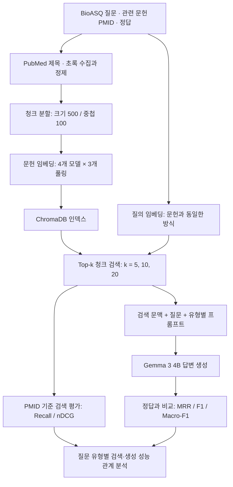

# RAG 프레임워크에서 검색과 생성 성능의 관계 분석

### 임베딩 모델과 풀링 전략을 중심으로

**Analysis of the Relationship Between Retrieval and Generation Performance in RAG: Focusing on Embedding Model and Pooling Strategies**

**박지원 · 양치복 | Ji won Park · Chi Bok Yang**

BioASQ 기반 생의학 질의응답에서 **검색 단계의 성능 우위가 생성 단계의 답변 품질로 얼마나 일관되게 이어지는지** 분석한 연구의 코드와 요약을 제공합니다. 네 가지 임베딩 모델과 세 가지 풀링 방식을 비교하고, 질문 유형과 검색 문서 수에 따라 검색·생성의 최적 조건이 어떻게 달라지는지 살펴봅니다.

> **핵심 결론:** 이 연구의 실험 조건에서 높은 검색 성능이 높은 생성 성능을 항상 보장하지 않았습니다. 최적의 임베딩 모델·풀링·Top-k 조합은 질문 유형과 평가 단계에 따라 달랐으며, 검색 지표와 최종 답변 품질을 함께 평가할 필요가 있었습니다.

[연구 배경](#연구-배경과-목적) · [연구 방법](#연구-방법) · [주요 결과](#주요-결과) · [기여와 한계](#연구의-기여와-한계) · [실행 안내](#실행-안내)

## 연구 배경과 목적

RAG(Retrieval-Augmented Generation)는 외부 문헌에서 질의와 관련된 정보를 검색하고, 이를 대규모 언어 모델의 문맥으로 제공해 답변을 생성합니다. 관련 문헌을 더 정확하게 검색하면 생성 모델이 활용할 근거도 좋아질 것으로 기대할 수 있습니다. 그러나 관련성이 높은 문헌이 실제 답변에 충분한 정보를 제공하는 것은 아니며, 검색 문서 수가 늘어나면 불필요한 정보도 함께 포함될 수 있습니다.

본 연구는 이러한 **검색 성능과 생성 성능의 불일치**에 주목합니다. 특히 토큰 표현을 문서 벡터로 집계하는 풀링 방식이 임베딩 모델 및 질문 유형과 결합할 때, 검색에서 나타난 성능 차이가 생성에서도 유지되는지를 비교합니다.

연구 목적을 다음 세 질문으로 정리할 수 있습니다.

1. **임베딩 모델과 풀링 방식**에 따라 검색 성능과 생성 성능의 우위는 어떻게 달라지는가?
2. **질문 유형**에 따라 검색 단계의 성능 우위가 생성 단계로 이어지는 경향은 어떻게 달라지는가?
3. **검색 문서 수 Top-k**를 늘렸을 때 검색과 생성의 성능 변화는 같은 방향으로 나타나는가?

## 연구 방법

### 1. 데이터와 전처리

2016년 BioASQ4의 질문·정답 및 관련 문헌 정보를 사용합니다. 질문 데이터에서 `summary` 유형과 실험에 사용하지 않는 `triples`, `concepts` 열을 제외하고, `factoid`, `list`, `yesno`를 구분해 평가합니다. 질문에 연결된 PMID를 기반으로 PubMed 제목과 초록을 수집하여 검색 말뭉치를 구성합니다.

| 항목 | 원고에 보고된 규모 |
|---|---:|
| 전처리 전 질문 | 1,307개 |
| 전처리 후 평가 질문 | 1,022개 |
| 수집 문헌 | 13,072개 |
| 중복·빈 값 처리 후 문헌 | 13,007개 |

| 질문 유형 | 정답의 특성 | 질문 수 | 생성 평가 지표 |
|---|---|---:|---|
| Factoid | 단일 개체·사실을 답하는 질문 | 327 | MRR |
| List | 여러 개체를 나열하는 질문 | 327 | F1-measure |
| Yes/No | 참·거짓 또는 긍정·부정을 판단하는 질문 | 368 | Macro-F1 |

위 규모는 원고 4.1절 기준입니다. 원본 배포 데이터와 실험에 사용한 부분집합의 대응은 [재현 안내](docs/reproducibility.md)에 기록했습니다.

### 2. 임베딩 모델과 풀링

문헌과 질의에 동일한 임베딩 방식을 적용합니다. 비교 대상은 아래 네 모델이며, 임베딩 차원은 원고 표 2에 기재된 값입니다.

| 모델 | 모델 식별자 | 임베딩 차원 |
|---|---|---:|
| S-BERT | `sentence-transformers/all-MiniLM-L6-v2` | 384 |
| BGE | `BAAI/bge-m3` | 1,024 |
| Solon | `OrdalieTech/Solon-embeddings-large-0.1` | 1,024 |
| Gemma | `google/embeddinggemma-300m` | 768 |

| 풀링 방식 | 벡터 구성 방법 | 코드의 컬렉션 접미사 |
|---|---|---|
| CLS | 마지막 층의 첫 번째 토큰 표현 사용 | `C` |
| Mean | 패딩을 제외한 유효 토큰 표현의 평균 | `M` |
| Max | 패딩을 제외한 유효 토큰 표현의 차원별 최댓값 | `X` |

임베딩용 `embeddinggemma-300m`과 답변 생성용 `gemma3:4b`는 서로 다른 모델입니다. 노트북에는 결합 풀링 및 추가 모델을 탐색한 코드도 있지만, 이 README의 결과는 원고의 **네 모델·세 풀링** 범위에 해당합니다.

### 3. 검색·생성 파이프라인



| 설정 | 값 |
|---|---|
| 검색 Top-k | 5, 10, 20 |
| 청크 크기 / 중첩 | 500 / 100 |
| 생성 모델 | Ollama `gemma3:4b` |
| 문서당 문맥 제한 | `MAX_DOC_CHARS = 1,000` |
| 전체 문맥 제한 | `MAX_TOTAL_CHARS = 40,000` |
| 응답 구조 | 질문 유형에 따른 `exact_answer`, `ideal_answer` |

검색 단위는 청크이며, 관련 문헌과의 일치는 PMID를 기준으로 평가합니다. 따라서 Top-k를 서로 다른 문헌 k개와 동일하게 해석해서는 안 됩니다. 질문 유형별 응답 형식은 [생성 프롬프트](prompt/rag_prompt2.yaml)에 정의되어 있습니다.

### 4. 평가 관점

검색 단계에서는 **Recall@k**로 관련 문헌의 검색 범위를, **nDCG@k**로 관련 결과의 순위를 평가합니다. 생성 단계에서는 질문 유형에 맞춰 factoid의 **MRR**, list의 **F1-measure**, yesno의 **Macro-F1**을 사용합니다.

검색 점수와 생성 점수는 평가 대상과 척도가 다릅니다. 또한 세 질문 유형의 생성 지표도 서로 다르므로, 점수의 크기만으로 질문 유형 간 난이도나 성능 우열을 비교하지 않습니다. 이 연구에서는 각 단계의 **우세한 설정과 성능 변화 방향이 일치하는지**에 주목합니다.

## 주요 결과

아래 내용은 제공 수정 원고의 4.2절과 표 4·5를 정리한 것입니다. 저장소 정리 과정에서 실험을 재실행하거나 수치를 새로 산출하지 않았습니다.

### 1. 검색과 생성의 최고 설정이 달랐습니다

| 질문 유형 | 검색 최고 조합 | 검색 점수¹ | 생성 최고 조합 | 생성 지표 | 생성 점수 |
|---|---|---:|---|---|---:|
| Factoid | BGE · CLS · k=20 | 0.6304² | BGE · Mean · k=20 | MRR | 0.1131 |
| List | Solon · Mean · k=20 | 0.6377 | Solon · Mean · k=10 | F1 | 0.1975 |
| Yes/No | Solon · Mean · k=20 | 0.6356 | S-BERT · CLS · k=5 | Macro-F1 | 0.7698 |

*출처: 원고 표 4, p. 13. [수치 CSV](results/paper_table4.csv)*

- **Factoid:** 최고 모델과 k는 유지되지만, 검색에서는 CLS, 생성에서는 Mean이 우세했습니다.
- **List:** Solon–Mean이 두 단계에서 우세했으나, 생성에서는 k=20보다 k=10이 최고 성능을 보였습니다.
- **Yes/No:** 최고 모델·풀링·k가 모두 달랐습니다. 검색에서 가장 좋은 조합을 그대로 선택하는 것이 생성에서도 최선은 아니었습니다.

¹ 원고 표 4의 `score`를 옮겼습니다. 표의 검색 점수가 Recall, nDCG 또는 집계값 중 무엇인지 명확하지 않아 특정 지표명을 부여하지 않았습니다.

² Factoid 검색 점수는 표 4에서 **0.6304**, 같은 페이지 본문에서 **0.6390**으로 다르게 표기됩니다. 여기서는 표의 값을 사용하며, 원시 결과 확인 전까지 차이를 임의로 수정하지 않습니다.

### 2. 검색에서 나타난 풀링 우위가 생성에 이어지는 정도는 질문 유형별로 달랐습니다

원고 그림 5는 BGE, S-BERT, Solon의 **Mean과 CLS 성능 차이**를 비교합니다. 이 분석에서 양수는 Mean, 음수는 CLS의 우위를 뜻하며, Gemma는 해당 비교에서 제외되어 있습니다.

| 질문 유형 | 원고에서 관찰한 검색·생성 관계 |
|---|---|
| Factoid | 검색 단계의 풀링 차이가 생성 단계에서는 완화되는 경향 |
| List | 검색 단계의 성능 경향이 생성에도 유사하게 나타나 가장 높은 일관성 |
| Yes/No | 일부 모델에서 검색과 생성의 우세한 풀링이 반대로 나타남 |

*출처: 원고 그림 5 및 설명, p. 12.*

이는 질문이 요구하는 정보와 정답 형식에 따라 검색 결과가 생성에 활용되는 방식이 달라질 수 있음을 시사합니다. 이 비교를 인과관계나 별도의 상관계수 검정 결과로 해석하지 않습니다.

### 3. Top-k 증가가 항상 생성 성능 향상으로 이어지지는 않았습니다

표 4의 검색 최고 조건은 세 질문 유형 모두 k=20이었지만, 생성 최고 조건은 factoid k=20, list k=10, yesno k=5로 달랐습니다. 표 5에서도 일부 yesno 조건에서는 검색 성능의 변화량이 양수인 반면 생성 성능의 변화량은 음수였습니다.

| Yes/No 조건 | 검색 평균 Top-k 격차 | 생성 평균 Top-k 격차 |
|---|---:|---:|
| BGE · CLS | +0.1527 | −0.0214 |
| S-BERT · Mean | +0.1450 | −0.0226 |
| Solon · Mean | +0.1625 | +0.0154 |

*출처: 원고 표 5 중 yesno의 세 조건 발췌, p. 14. 표의 평균 격차를 그대로 옮긴 값이며 k=5와 k=20의 직접 차이나 상대 향상률로 재해석하지 않습니다.*

이 결과는 더 많은 문맥이 항상 유리하지 않다는 점을 보여주는 동시에, **같은 yesno 유형에서도 모델·풀링 조합에 따라 변화 방향이 다름**을 보여줍니다.

### 4. 풀링의 효과는 임베딩 모델에 따라 달랐습니다

원고 그림 3·4에서는 Mean 풀링이 전반적으로 안정적인 경향을 보였고, 여러 조건에서 CLS도 경쟁력 있는 성능을 보였습니다. Gemma 임베딩은 Mean을 적용했을 때 CLS보다 나은 성능을 보였으며, Max는 전반적으로 상대적으로 낮은 결과를 보였습니다. 따라서 하나의 풀링을 모든 모델과 질문 유형에 공통으로 적용하기보다 모델별·유형별 검토가 필요합니다.

## 연구의 기여와 한계

### 연구의 기여

- **검색·생성 통합 평가:** 검색 성능의 우위가 최종 답변 품질로 이어지는지를 함께 비교하여, 검색 지표만으로 RAG 전체 성능을 판단하기 어렵다는 근거를 제공합니다.
- **질문 유형의 역할:** factoid, list, yesno의 정답 특성에 따라 성능 전달과 최적 Top-k가 달라질 수 있음을 보여줍니다.
- **문서 표현 전략의 영향:** 임베딩 모델과 풀링 방식의 조합을 비교함으로써 모델 규모나 임베딩 차원만으로 최종 성능을 예상하기 어렵다는 점을 보여줍니다.

실무적으로는 검색 단계만 따로 최적화하기보다, **질문 유형별로 검색 설정을 바꾸면서 최종 답변 품질을 함께 평가하는 접근**을 제안합니다.

### 한계와 후속 연구

| 한계 | 후속 검토 방향 |
|---|---|
| BioASQ 생의학 도메인으로 한정 | 다른 도메인과 데이터에서 결과의 일반화 확인 |
| 생성 모델 `gemma3:4b` 한 종류 | 다른 LLM을 사용한 비교 |
| k=5/10/20 및 고정 청크·프롬프트 | 검색 문서 수 세분화, 청크·프롬프트 조건 확장 |
| 검색 문맥의 품질 개선 방법 미비교 | 재정렬과 불필요한 문맥 제거의 효과 검토 |

*출처: 원고 결론 및 한계점, pp. 15–16.*

## 저장소 구성

- [평가 모듈](rag_pipeline/): 임베딩·풀링, 프롬프트, 평가 및 명령행 실행
- [논문 상세 요약](docs/paper-summary.md): 연구 질문, 방법, 결과, 한계
- [재현 안내 및 확인 사항](docs/reproducibility.md): 노트북 실행 범위와 원고·코드 차이
- [임베딩 실험 노트북](notebooks/rag_embeddings.ipynb): `rag_논문.ipynb`의 정리본
- [RAG 평가 노트북](notebooks/rag_evaluation.ipynb): 데이터 전처리, 검색·생성, 결과 집계
- [생성 프롬프트](prompt/rag_prompt2.yaml): 질문 유형에 따른 JSON 답변 형식
- [데이터 안내](data/README.md): 로컬 데이터 구성과 준비 방법
- [원고 표 4 결과](results/paper_table4.csv): 원고에서 옮긴 요약 수치

## 실행 안내

평가 셀은 `rag_pipeline/` 패키지로도 분리했습니다. `embeddings.py`는 임베딩·풀링, `prompts.py`는 프롬프트 로딩, `evaluator.py`는 평가, `__main__.py`는 실행 인자를 담당합니다. 기존 Chroma 인덱스를 사용하는 평가 진입점이며 인덱스 구축은 아래 노트북 흐름을 사용합니다.

```bash
pip install -r requirements.txt
python -m rag_pipeline --help
python -m rag_pipeline --dataset data/bioasq_factoid.csv --chroma-dir 500-100/embeddinggemma/chroma_db --collections gemma_C gemma_M gemma_X --k 5 10 20 --dry-run
```

입력 경로를 확인한 후 `--dry-run`을 제거하면 실제 평가를 실행합니다. 실행 설정은 출력 폴더에 JSON으로 남습니다. `--dry-run`은 파일·CSV 열·인자만 검사하며 모델 호환성이나 Ollama 연결을 확인하지 않습니다. 핵심 평가 계산은 원본을 유지했습니다. 의존성 버전 고정과 전체 실험 재현은 검증되지 않았습니다.

빠른 입력 검증 테스트: `python -m unittest rag_pipeline.test_cli -v`

두 노트북은 **선택 실행용 연구 기록**입니다. 서로 다른 모델 실험, Colab 명령, 중간 점검 셀이 함께 있으므로 `Run All`로 완전 재현되는 패키지는 아닙니다.

1. [데이터 안내](data/README.md)에 따라 BioASQ JSON 및 PubMed CSV를 로컬에 준비합니다.
2. Jupyter 환경에 노트북의 설치 셀에 명시된 패키지를 준비합니다. 원래 실험의 정확한 버전 잠금 파일은 제공되지 않았습니다.
3. 필요한 경우 `HF_TOKEN`, PubMed 수집 시 `NCBI_EMAIL` 환경변수를 설정합니다. 인증정보를 노트북에 직접 저장하지 마세요.
4. 저장소 루트에서 Jupyter를 시작합니다. 첫 설정 셀은 노트북 폴더에서 시작한 경우에도 루트를 찾습니다.
5. 임베딩 노트북에서 모델과 풀링을 선택하고 컬렉션을 구축합니다. 평가 노트북의 `CHROMA_DIR`, `collection_list`를 그 컬렉션과 일치시킵니다.
6. 로컬 Ollama에 `gemma3:4b`를 준비하고, 평가·집계 셀을 선택 실행합니다.

세부 실행 순서와 알려진 제한은 [재현 안내](docs/reproducibility.md)를 참고하세요.

## 공개 범위

코드, 프롬프트, 논문 요약과 원고의 집계 수치를 포함합니다. 노트북 출력·실행 메타데이터·하드코딩된 인증정보는 제거했습니다. 대용량 Chroma DB, 원문 데이터, 실험별 원시 응답, 논문 PDF 원본은 이 공개본에 포함하지 않습니다. 원본 파일은 별도로 보존되어 있습니다.

코드에 대한 별도 공개 라이선스는 아직 지정하지 않았습니다. 데이터와 모델의 이용 조건은 각 제공처의 조건을 따릅니다.

## 원고 및 인용 정보

이 README는 박지원·양치복의 「RAG 프레임워크에서 검색과 생성 성능의 관계 분석: 임베딩 모델과 풀링 전략을 중심으로」 제공 수정 원고를 기준으로 작성했습니다. 결과 설명의 표·그림 번호와 페이지는 해당 PDF에 대응합니다.

원고의 권·호·발행일·게재 확정일은 자리표시자 상태이므로, 확인되지 않은 출판 연도나 DOI를 인용 정보에 추가하지 않았습니다. 정식 서지정보가 확정되면 갱신할 수 있습니다. BioASQ 데이터의 원본 인용 정보는 [데이터 배포 안내](data/SOURCE_README.txt)를 참고하세요.

원고 수치와 구현 간 확인 사항, 이번 공개본에서 검증한 범위는 [재현 안내](docs/reproducibility.md)에 정리되어 있습니다.
